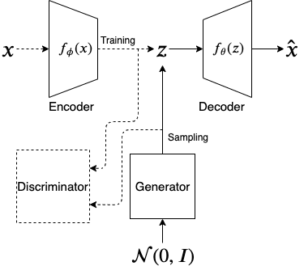
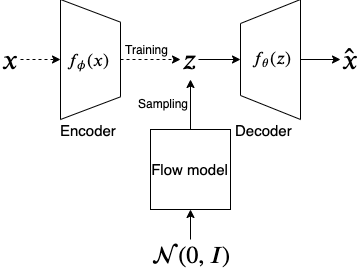

---
layout: page
---

<h3><b>AdvAE and FlowAE : Sampling Arbitrary Latent Variable Distributions in an Autoencoder</b></h3>

[Link to poster](DGM_Poster_2.pdf) 
[Link to video presentation](https://youtu.be/4BK_eIzsYNc) 

**Abstract** — In the traditional variational autoencoder (VAE), the latent variable is sampled from a simple prior distribution which is usually Gaussian. Also, the training objective of the VAE seeks to minimize the KL-divergence between the posterior and the Gaussian prior. While the simple prior makes the sampled latent variable less expressive, the training objective may impose a prior that does not fit the data distribution well. We propose to learn an arbitrarily distributed latent space using an autoencoder and then use a generative model to learn the arbitrary distribution for the latent variable. For this, we propose two types of architectures. One (AdvAE) is similar to the [adversarial autoencoder](https://arxiv.org/abs/1511.05644) where a generator network will be adversarially trained to generate latent variable samples similar to an arbitrary latent space learned by an autoencoder. The second (FlowAE) uses a normalizing flow model which will be trained to generate latent variable samples from the same arbitrary latent space.

We demonstrate the performance of the model using 1) observed quality of MNIST samples, 2) Frechet Classifier Distance scores, 3) visualization of the latent space using t-SNE, 4) ease of training

<em>Architecture of AdvAE</em>

<em>Architecture of FlowAE</em>

