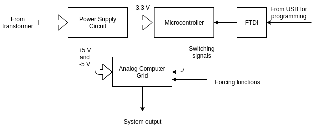

---
layout: page
permalink: /dpac
---

###Digitally Programmable Analog Computer###
Electronics Design project with Dhruv Shah, Sachin Goyal

[Link to project report](dpac.pdf)

***Abstract*** — Hardware-in-the-loop simulations are very commonly used to test controller design and monitor how the controller responds, in real time, to realistic virtual stimuli. In an HIL simulation, a real-time computer is used as a virtual representation of the plant model and a real version of the concerned controller. Most of these dynamical systems are in the form of coupled differential equations, and digital computers tend to be terribly slow at iteratively approximating solutions to such systems. The notion of using analog computing grids to efficiently solve differential equations (in hardware) has been well accepted in the research fraternity, and proves to be a faster way to solve linear dynamical systems. In this project, we demonstrate a digitally programmable analog computer, which can solve linear dynamical systems with upto 5 state variables. The system is capable of working in real time, since there are no moving parts once the configuration is set and the system is programmed. The system is capable of being driven by upto 5 forcing functions, and can represent any linear dynamical system of the form  x' = Ax + Bu  y = Cx + Du  It consists of active devices to implement integrators, gain blocks and inverter blocks using operational amplifiers, along with passive components to emulate the system matrix. These blocks will be linked together using analog switches which would be controlled by signals given by a microcontroller. For our first prototype, we assume B = C = I , for the sake of simplicity. In this report, we present the design philosophies, layout descriptions, experimental results and analyses of two prototypes ㅡ DPAC-𝜷 and DPACv1.0. The DPAC-𝜷 is a miniature version of the DPACv1.0, to emulate second order systems, and features a block-modular structure and mechanical switches, allowing easy configuration of the system matrix and operational parameters. The DPACv1.0 features a single PCB, is interfaced and controlled using a microcontroller, and is capable of solving the linear dynamical system in real time.

<em>Overview of our system</em>

