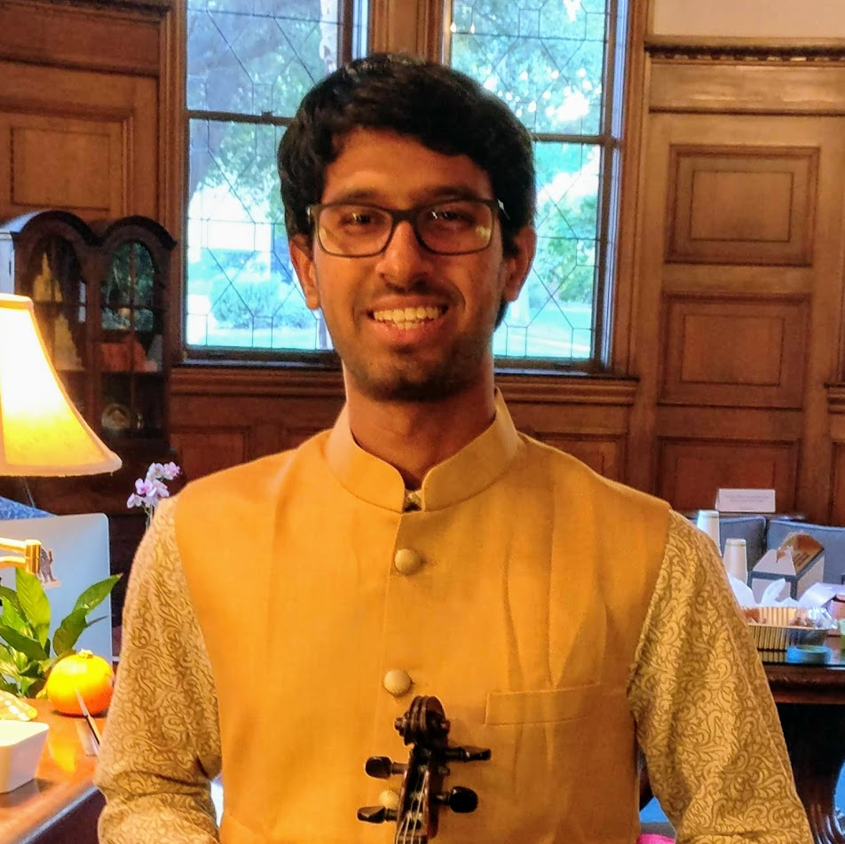

---
# Feel free to add content and custom Front Matter to this file.
# To modify the layout, see https://jekyllrb.com/docs/themes/#overriding-theme-defaults

layout: home
title: About Me
---

{:height="250px" width="250px"}

### **Education** ###
1. B.Tech. in Electrical Engineering (2015-2019) 
Indian Institute of Technology Bombay (Mumbai, India)
2. MS and PhD in Electrical Engineering (2019-) 
Stanford University (California, USA)

My current research is in analyzing and imporving the security and latency of blockchain protocols. I am also broadly interested in information theory, machine learning, and their intersections. I am grateful to have [Prof. David Tse]( https://tselab.stanford.edu/) and [Prof. Mert Pilanci](https://stanford.edu/~pilanci/) as my PhD advisors.

Please read my [CV](CV.pdf) or look at my [projects](/projects) to know about my work and achievements.

I am also a violinist and singer in the Carnatic (south Indian) classical style of music. I am an ardent fan of Indian classical music and I'm committed to preserving and popularising this art.  
[Youtube link to my performances](https://www.youtube.com/playlist?list=PLOqYw2iE3KdzhvCYeVnATlJJZ3kfY6p_X)
