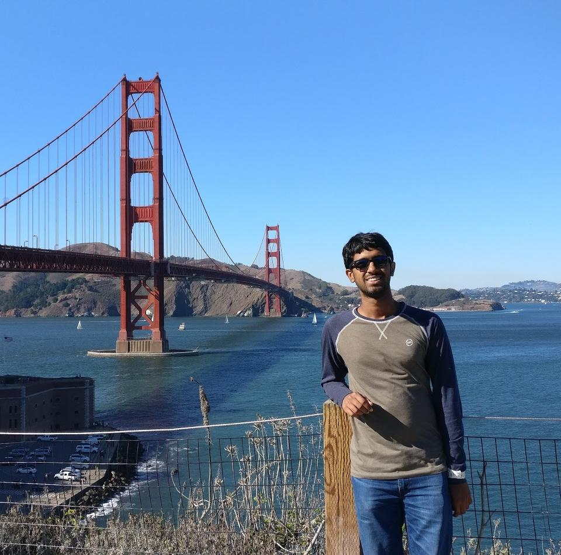

---
# Feel free to add content and custom Front Matter to this file.
# To modify the layout, see https://jekyllrb.com/docs/themes/#overriding-theme-defaults

layout: home
title: About Me
---

{:height="40%" width="40%"}

### **Education** ###
1. B.Tech. in Electrical Engineering (2015-2019) 
Indian Institute of Technology Bombay (Mumbai, India)
2. MS and PhD in Electrical Engineering (2019-) 
Stanford University (California, USA)

My research interests broadly include machine learning, optimization and information theory, and their intersections. <!-- I am honored to have [Prof. David Tse](https://tselab.stanford.edu/) and [Prof. Mert Pilanci](https://stanford.edu/~pilanci/) as my PhD advisors. -->

Please read my [CV](CV Jun 2020.pdf) or look at my [projects](/projects) to know about my work and achievements.

<!-- A few projects I am interested to pursue:
1. **Music processing** - I am interested in music transcription, source separation, and analysis of music perception. As a musician myself, I am interested to develop tools to assist musicians and to understand music as a signal better. I have previously worked on note onset detection in piano music with a [publication](https://www.ee.iitb.ac.in/student/~daplab/publications/2018/p154-subramani.pdf) resulting from this work.
1. **Speech processing** - I am particularly interested in studying speech perception and cognition in detail. I wish to use this knowledge to assist people with speaking or hearing diabilities to communicate better, by means of improved hearing aids and speech synthesizers.
1. **Information theory** - I have gained interest in information theory topics through advanced courses during my undergrad. Recently I have been studying secure multiparty computation, and communication and randomness lower bounds for this task. I am further interested to direct my research in areas such as coding, data compression, and security. -->

I am also a singer and a violinist with training in the Carnatic (south Indian) classical style of music. I enjoy listening to music from a variety of genres and from across the world. I am an ardent fan of Indian classical music and I'm committed to preserving and popularising this art.  
[Some of my performances](https://www.youtube.com/playlist?list=PLOqYw2iE3KdzhvCYeVnATlJJZ3kfY6p_X)
