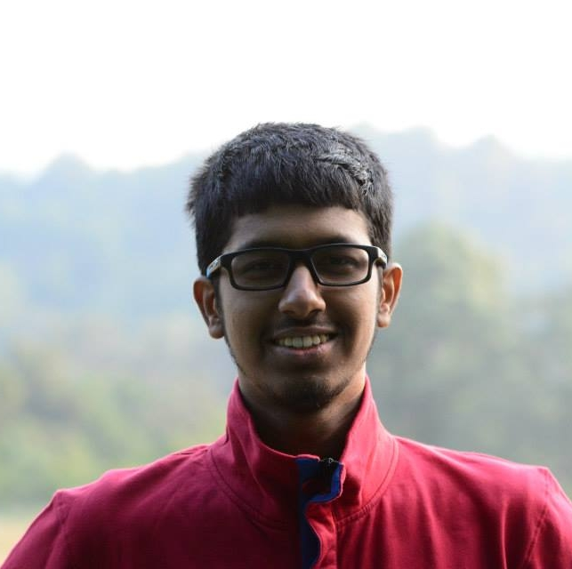

---
# Feel free to add content and custom Front Matter to this file.
# To modify the layout, see https://jekyllrb.com/docs/themes/#overriding-theme-defaults

layout: home
title: About Me
permalink: /about/
---

{:height="40%" width="40%"}

I am an undergraduate student at the Indian Institute of Technology Bombay (Mumbai, India), pursuing my B.Tech. degree in Electrical Engineering.

My research interests broadly include signal processing (theory, and music/speech/image applications), machine learning, information theory and circuits.

A couple of projects I am interested to pursue:
1. Music processing - I am interested in music transcription, source separation, and analysis of music perception. As a musician myself, I am interested to develop tools to assist musicians and to understand music as a signal better. I have previously worked on note onset detection in piano music with a [publication](https://www.ee.iitb.ac.in/student/~daplab/publications/2018/p154-subramani.pdf) resulting from this work.
1. Eye-friendly displays - Traditional electronic displays are credited with causing eye strain and deteriorating the natural performance of the eyes. Many professionals who work with computers everyday face problems because of this. I am interested to study the causes of eye strain due to displays and develop alternative technologies to reduce this.

I am also a singer and a violinist with training in the Carnatic (south Indian) classical style of music. I enjoy listening to music from a variety of genres and from across the world. I am an ardent fan of Indian classical music and I'm forever committed to preserving and popularising this art.

Please read my [CV](CV Dec 2018-2.pdf) or look at my [projects](/projects) to know about my work and achievements.