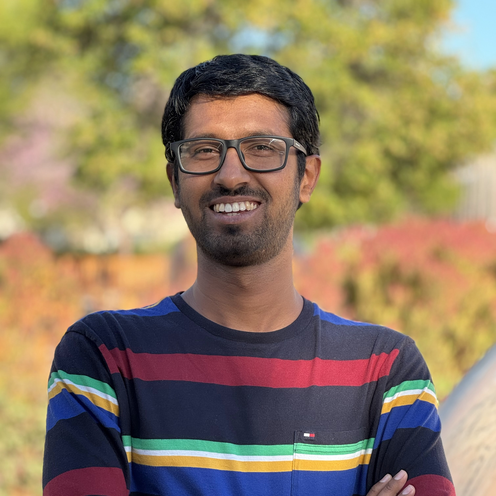

---
# Feel free to add content and custom Front Matter to this file.
# To modify the layout, see https://jekyllrb.com/docs/themes/#overriding-theme-defaults

layout: home
---

{:height="40%" width="40%"}

I am an undergraduate student at the Indian Institute of Technology Bombay (Mumbai, India), pursuing my B.Tech. degree in Electrical Engineering.

My research interests broadly include signal processing (theory, and music/speech/image applications), machine learning, information theory and circuits.

I am also a singer and a violinist with training in the Carnatic (south Indian) classical style of music. I am very passionate about music and this has also led to my research interest in music information retrieval.