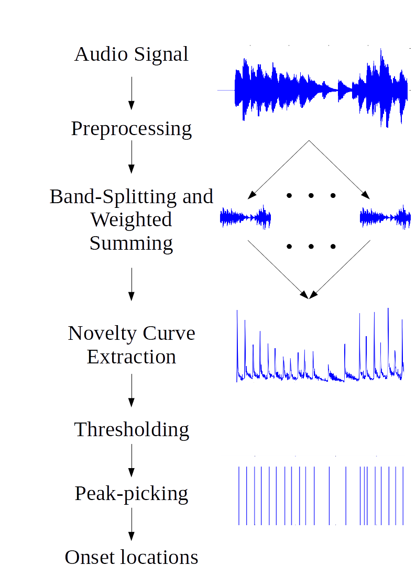
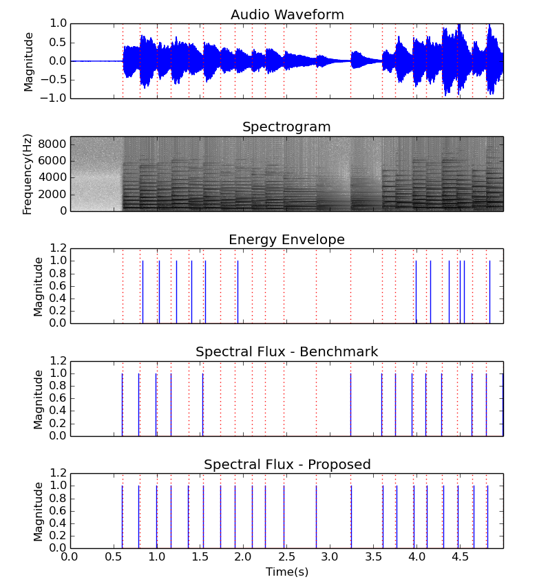

---
layout: page
permalink: /onset_detection
---

### Energy-Weighted Multi-Band Novelty Functions for Onset Detection in Piano Music

[Link to publication](https://www.ee.iitb.ac.in/student/~daplab/publications/2018/p154-subramani.pdf) 
[Link to conference presentation](conference_presentation.pdf)

***Abstract*** — Onset detection refers to the estimation of the timing of events in a music signal. It is an important sub-task in music information retrieval and forms the basis of high-level tasks such as beat tracking and tempo estimation. Typically, the onsets of new events in the audio such as melodic notes and percussive strikes are marked by short-time energy rises and changes in spectral distribution. However, each musical instrument is characterized by its own peculiarities and challenges. In this work, we consider the accurate detection of onsets in piano music. An annotated dataset is presented. The operations in a typical onset detection system are considered and modified based on specific observations on the piano music data. In particular, the use of energy-based weighting of multi-band onset detection functions and the use of a new criterion for adapting the final peak-picking threshold are shown to improve the detection of
soft onsets in the vicinity of loud notes. We further present a grouping algorithm which reduces spurious onset detections.

While the benchmark method based on spectral flux had a false negatives rate of 14.97%, our proposed method acheives a false negative rate of 3.38% while maintaining nearly the same false positives rate.

<em>A flowchart describing the stages in our proposed method of onset detection</em>

<em>A comparison of the energy envelope method, spectral flux based benchmark method, and our method using energy-weighted bands and adaptive thresholding. Red dotted lines : ground truth onsets, Blue lines : detected onsets</em>

