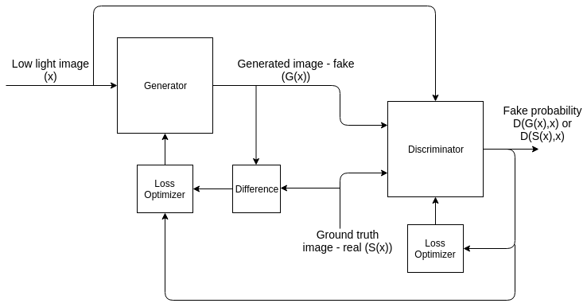

---
layout: page
permalink: /see_in_the_dark
---

See In The Dark
Image Processing Project along with R. Shrinivas

[Link to project report](https://drive.google.com/file/d/197rulD8Zi53JZjOPDQwWhbxyBgTdWtoS/view?usp=sharing)

***Abstract*** — See In The Dark presents a method to reconstruct bright images from images shot in low-light conditions Due to limitations in exposure time and aperture size, images shot in low-light conditions have very little detail and poor SNR. Increasing their brightness leads to enhancement of noise in the image. Our project presents an end-to-end low-light image brightnening system using a Conditional Generative Adversarial Network (cGAN). We have implemented and trained the GAN ourselves, and have also proposed a modified ”soft” sigmoid activation function to prevent GAN collapse. We present the applications of low-light imaging, its challenges, traditional approaches and their limitations. Then we present our method - its architecture, dataset used and a summary of its results.

<em>Overview of our cGAN architecture</em>

